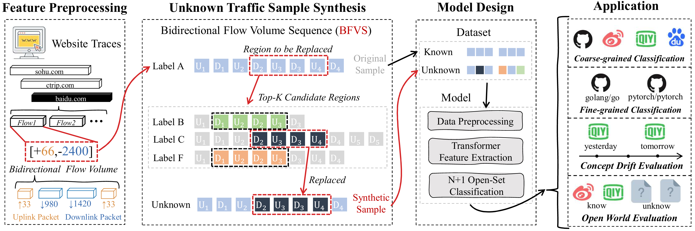

# BFVS
Implementation of "BFVS: Efficient Flow Volume Representation and Unknown Traffic Synthesis for Open-World Encrypted Traffic Analysis"


This repository provides the code and dataset of BFVS for encrypted traffic analysis. It includes the implementation of the **Bidirectional Flow Volume Sequence (BFVS)** representation, which compresses traffic traces into discriminative flow-level sequences, as well as an open-world recognition mechanism based on cross-class semantic perturbation. The repository also contains scripts for training and evaluation on both coarse-grained and fine-grained datasets, supporting experiments under concept drift and open-world scenarios.



If you find this method helpful for your research, please cite our work:

```latex
@misc{xian2025udfs,
      title={UDFS: Lightweight Representation-Driven Robust Network Traffic Classification}, 
      author={Youquan Xian and Xueying Zeng and Mei Huang and Aoxiang Zhou and Xiaoyu Cui and Peng Liu and Lei Cui},
      year={2025},
      eprint={2509.11157},
      archivePrefix={arXiv},
      primaryClass={cs.NI},
      url={https://arxiv.org/abs/2509.11157}, 
}
```

-----

### Requirements
```
matplotlib==3.10.6
numpy==2.3.3
pandas==2.3.2
scapy==2.6.1
scikit_learn==1.7.2
torch==2.7.0+cu118
tqdm==4.67.1
```


-----

### Dataset Format

The dataset is expected to be in the form of a **pickled Pandas DataFrame** (`.pkl`). Each `.pkl` file should represent a complete dataset (e.g., for training or testing).

The DataFrame must contain at least two columns:

  - `features`: A list or NumPy array represents the characteristics of a complete access record (trace) to a website represented by UDFS.
  - `label`: A string representing the application or class index (e.g., `0`, `1`).

An example of the DataFrame structure:

|    |   label | features                                                                                                                                                                                                                                              |
|---:|--------:|:------------------------------------------------------------------------------------------------------------------------------------------------------------------------------------------------------------------------------------------------------|
|  0 |       5 | [[8218, 306213], [11155, 997100], [1829, 5857], [1893, 5857], [1893, 5857], [1893, 5857], [1829, 5857], [6143, 9325931], [2588, 4922]]                                                                                                                |
|  1 |       7 | [[2438, 123706], [1797, 5857], [1893, 5857], [10972, 774600], [1829, 5857], [1797, 5857], [1829, 5857], [2641, 4398]]                                                                                                                                 |
|  2 |       7 | [[2502, 123775], [11004, 768523], [1893, 5857], [1861, 5857], [1893, 5857], [1829, 5857], [1861, 5857], [2019, 4398]]                                                                                                                                 |
-----

## How to Use

### Step 1: Build the Dataset

First, construct the BFVS traffic dataset using `build_dataset.py`.

```bash
python build_dataset.py
```

The generated dataset will be saved as `.pkl` files containing:

* `features`: BFVS sequence features
* `label`: traffic category labels

Example dataset formats can be found in the `datasets/` directory.

---

### Step 2: Generate Pseudo-Unknown Samples

After constructing the original dataset, generate pseudo-unknown traffic samples using `build_fake_dataset.py`.

```bash
python build_fake_dataset.py
```

This script synthesizes pseudo-unknown samples through cross-class semantic perturbation by adaptively replacing heterogeneous local Flow segments. The generated dataset will be used as the additional unknown category during open-world training.

---

### Step 3: Configure Training Parameters

Open `main.py` and configure the dataset paths and hyperparameters.

#### Dataset Paths

* `TRAIN_PKL`: known-class training dataset
* `NEGATIVE_TRAIN_PKL`: synthesized pseudo-unknown dataset
* `TEST_PKL`: testing dataset
* `WORLD_PKL`: additional unknown dataset for open-world evaluation (optional)

#### Output Directory

* `SAVE_DIR`: directory for saving checkpoints and evaluation results

#### Training Hyperparameters

Important hyperparameters include:

* `LR`: learning rate
* `EPOCHS`: number of training epochs
* `BATCH_SIZE`: batch size
* `D_MODEL`: Transformer hidden dimension
* `N_HEAD`: number of attention heads
* `N_LAYERS`: number of Transformer encoder layers

---

### Step 4: Train and Evaluate the Model

Run the following command:

```bash
python main.py
```

The script automatically performs:

1. BFVS feature loading and preprocessing
2. Construction of the augmented ((N+1))-class training set
3. Transformer model training
4. Closed-set evaluation
5. Open-set evaluation
6. Unknown traffic detection analysis
7. Latency profiling

---

### Step 5: Analyze the Outputs

All outputs will be saved in the directory specified by `SAVE_DIR`.

Key output files include:

* `model.pt`
  Trained model checkpoint

* `label_encoder.pkl`
  Label encoder for known classes

The console output additionally reports:

* Closed-set metrics
* Open-set metrics
* AUROC
* Unknown traffic detection performance
* Detailed classification reports
* Training and inference latency statistics

These results can be used to evaluate the effectiveness, robustness, and generalization capability of the proposed framework under both concept drift and open-world scenarios.
